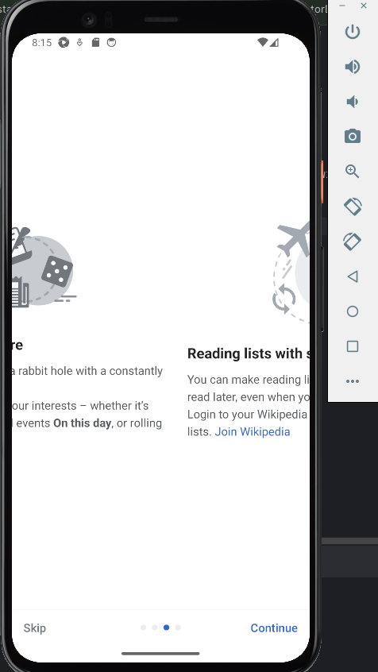

<h4>В данном проекте тестируется мобильное приложение Википедии в трех средах:

- Сервис с удаленными устройствами Browserstack;
- Эмулятор android studio;
- Реальное подключенное устройство.</h4>

<h6>Видео с запуском теста при помощи Browserstack:</h6>

   

<h6>Скриншот выполнения теста в эмуляторе android studio:</h6>

