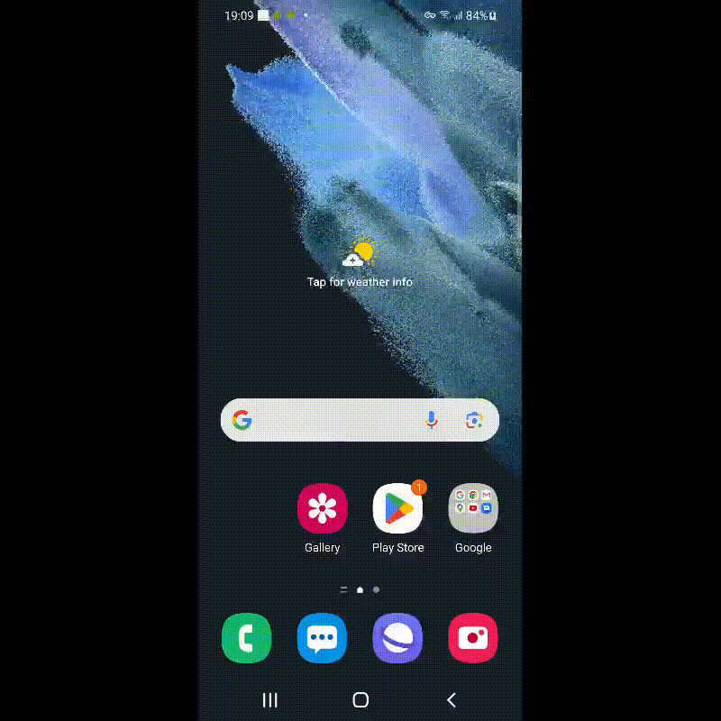

<h3>
В данном проекте тестируется мобильное приложение Википедии в трех средах:
</h3>

- Сервис с удаленными устройствами Browserstack;
  <h6>Запуск при помощи команды: ./gradlew clean test -DdeviceHost=browserstack</h6>
- Эмулятор android studio;
  <h6>Запуск при помощи команды: ./gradlew clean test -DdeviceHost=emulation</h6>
- Реальное подключенное устройство.</h4>
  <h6>Запуск при помощи команды: ./gradlew clean test -DdeviceHost=real</h6>

Видео с запуском теста при помощи Browserstack:

   

