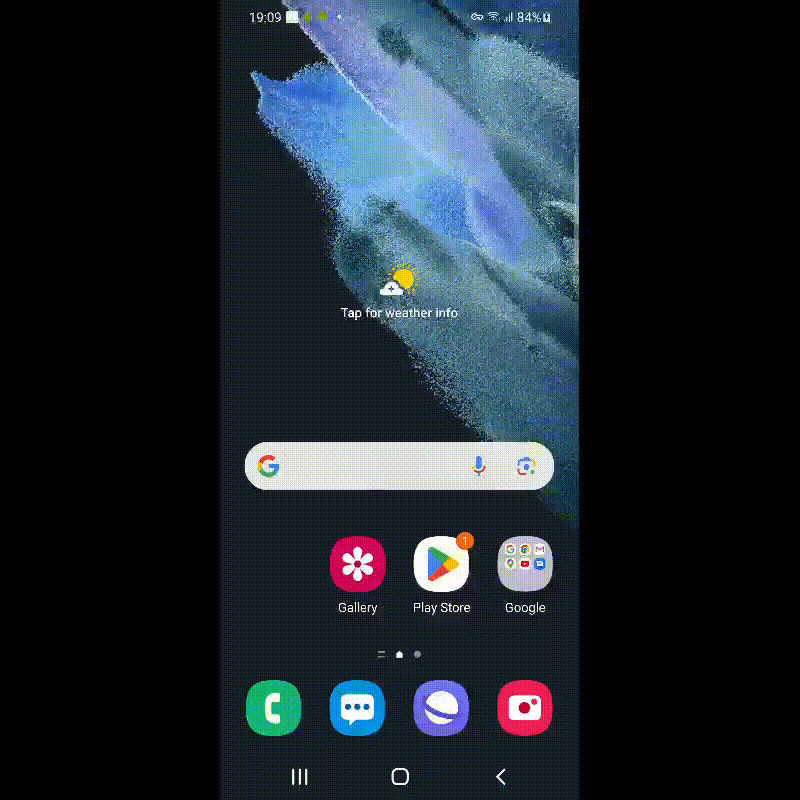

В данном проекте тестируется мобильное приложение Википедии в трех средах:

- Сервис с удаленными устройствами Browserstack;
- Эмулятор android studio;
- Реальное подключенное устройство.</h4>

<h4>Запуск теста осуществляется командой:</h4>
<h6>./gradlew clean App_test -DdeviceHost=среда</h6>
<h4>где "среда" = browserstack, emulator или real.</h4>

<h6>Видео с запуском теста при помощи Browserstack:</h6>

   

